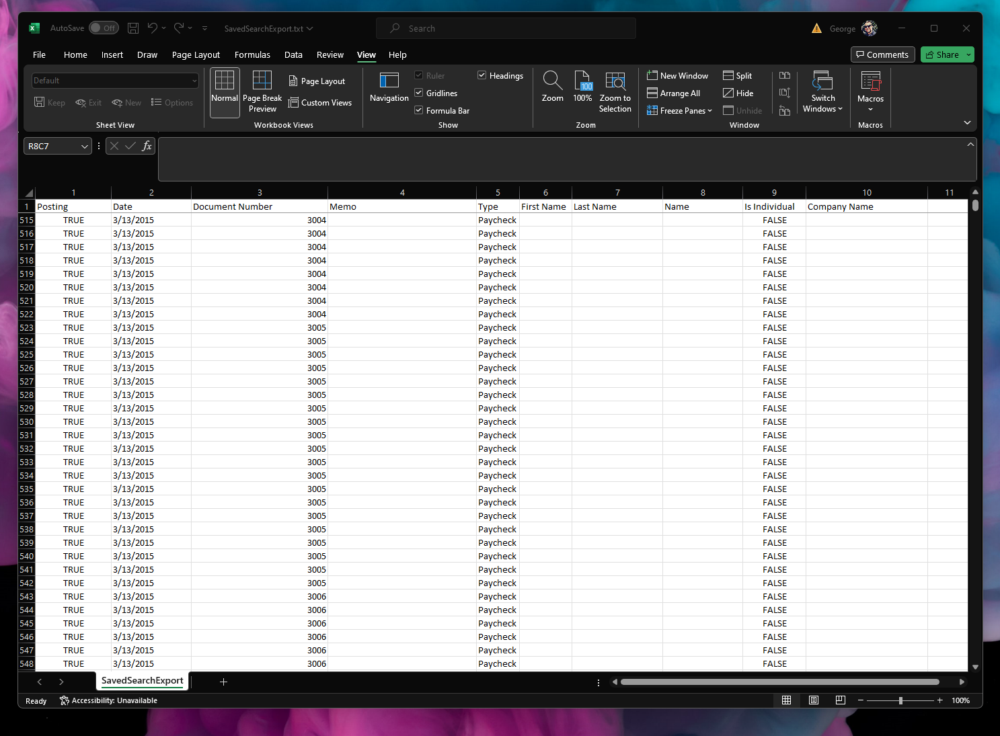

# NetSuite Saved Search Export CSV
Simple Scheduled script that export Saved Search results to CSV file

## Used libraries
- csv-stringify (https://www.npmjs.com/package/csv-stringify)

## Features
- Saved Search column labels are used for CSV headers
- File Cabinet file size limit is overcome by using appendLine

## Performance
- Tested with 10 column Saved Search / 112626 lines
- Processing time: 9 minutes
- Output CSV Filesize: 6.79 MB 

## Screenshots
